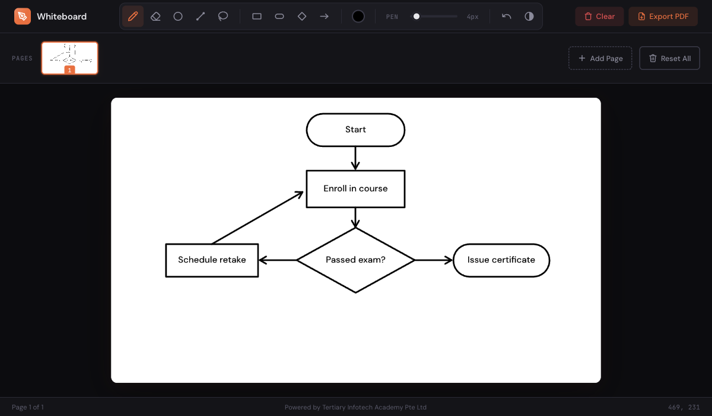

<div align="center">

# Whiteboard

[](https://developer.mozilla.org/en-US/docs/Web/HTML)
[](https://developer.mozilla.org/en-US/docs/Web/CSS)
[](https://developer.mozilla.org/en-US/docs/Web/JavaScript)
[](https://github.com/parallax/jsPDF)
[](LICENSE)
[](https://alfredang.github.io/whiteboard/)

**A minimal, browser-based drawing tool with a dark creative-studio aesthetic. Built for educators and trainers.**

[Live Demo](https://alfredang.github.io/whiteboard/) · [Report Bug](https://github.com/alfredang/whiteboard/issues) · [Request Feature](https://github.com/alfredang/whiteboard/issues)

</div>

## Screenshot



## About

Whiteboard is a lightweight, zero-dependency drawing application designed for classroom and training environments. It runs entirely in the browser with no backend or build step required — just open `index.html` and start drawing.

### Key Features

| Feature | Description |
|---------|-------------|
| **Multi-page support** | Add, delete, and navigate between pages with live thumbnail previews |
| **Pen & Eraser** | Drawing tools with keyboard shortcuts (`B` / `E`) |
| **Color picker** | Full color selection with visual swatch indicator |
| **Adjustable brush size** | Slider control from 1px to 50px |
| **Undo** | Per-page undo history (Ctrl/Cmd+Z, up to 30 states) |
| **PDF export** | All pages exported as a single landscape PDF document |
| **Page navigation** | PgUp/PgDn or Ctrl+Arrow keys to switch pages |
| **Touch support** | Full touch input for tablets and mobile devices |
| **Coordinate tracking** | Real-time cursor position in the status bar |
| **Responsive layout** | Adapts to any screen size with smooth animations |

## Tech Stack

| Category | Technology |
|----------|------------|
| **Markup** | HTML5 Canvas |
| **Styling** | CSS3 (custom properties, animations, responsive) |
| **Logic** | Vanilla JavaScript (ES6+) |
| **PDF Export** | [jsPDF 3.0](https://github.com/parallax/jsPDF) (CDN) |
| **Fonts** | [DM Sans](https://fonts.google.com/specimen/DM+Sans) + [JetBrains Mono](https://fonts.google.com/specimen/JetBrains+Mono) |
| **Deployment** | GitHub Pages |

## Architecture

```
┌─────────────────────────────────────────────────┐
│                   Browser                       │
│                                                 │
│  ┌──────────┐  ┌────────────┐  ┌────────────┐  │
│  │  Header   │  │  Page Strip │  │ Status Bar │  │
│  │  Toolbar  │  │  Thumbnails │  │  Coords    │  │
│  └────┬─────┘  └──────┬─────┘  └────────────┘  │
│       │               │                         │
│       ▼               ▼                         │
│  ┌─────────────────────────┐                    │
│  │    HTML5 Canvas (1200×700)                   │
│  │    ├── Drawing Engine    │                    │
│  │    ├── Undo Stack (×30)  │                    │
│  │    └── Page State Mgmt   │                    │
│  └────────────┬────────────┘                    │
│               │                                 │
│               ▼                                 │
│  ┌─────────────────────────┐                    │
│  │   jsPDF (CDN)           │                    │
│  │   └── Multi-page export │                    │
│  └─────────────────────────┘                    │
└─────────────────────────────────────────────────┘
```

## Project Structure

```
whiteboard/
├── index.html          # Main HTML with toolbar, canvas, page strip, and status bar
├── styles.css          # Dark theme, responsive layout, animations
├── whiteboard.js       # Drawing engine, page management, undo, PDF export
├── preview.png         # Screenshot for README
└── README.md
```

## Getting Started

### Prerequisites

- Any modern web browser (Chrome, Firefox, Safari, Edge)

### Installation

```bash
git clone https://github.com/alfredang/whiteboard.git
cd whiteboard
```

### Usage

Open `index.html` directly in your browser, or serve it locally:

```bash
# Using Python
python3 -m http.server 8000

# Using Node.js
npx serve .
```

Then visit `http://localhost:8000`.

Or use the live version: **[https://alfredang.github.io/whiteboard/](https://alfredang.github.io/whiteboard/)**

### Keyboard Shortcuts

| Shortcut | Action |
|----------|--------|
| `B` | Select Pen tool |
| `E` | Select Eraser tool |
| `Ctrl/Cmd + Z` | Undo |
| `PgUp` / `Ctrl + ←` | Previous page |
| `PgDn` / `Ctrl + →` | Next page |

## Deployment

This project is deployed to **GitHub Pages** directly from the `main` branch. No build step is needed — the site is served as static HTML.

To deploy your own fork:

1. Fork this repository
2. Go to **Settings > Pages**
3. Set source to `Deploy from a branch` → `main` → `/ (root)`
4. Your site will be live at `https://<your-username>.github.io/whiteboard/`

## Contributing

Contributions are welcome!

1. Fork the repository
2. Create your feature branch (`git checkout -b feature/amazing-feature`)
3. Commit your changes (`git commit -m 'Add amazing feature'`)
4. Push to the branch (`git push origin feature/amazing-feature`)
5. Open a Pull Request

For questions or suggestions, use [GitHub Discussions](https://github.com/alfredang/whiteboard/discussions).

## Developed By

**Tertiary Infotech Academy Pte Ltd**

## Acknowledgements

- [jsPDF](https://github.com/parallax/jsPDF) — Client-side PDF generation
- [DM Sans](https://fonts.google.com/specimen/DM+Sans) & [JetBrains Mono](https://fonts.google.com/specimen/JetBrains+Mono) — Typography
- [Google Fonts](https://fonts.google.com/) — Font delivery

## License

MIT

---

<div align="center">

If you found this useful, please consider giving it a star!

</div>
